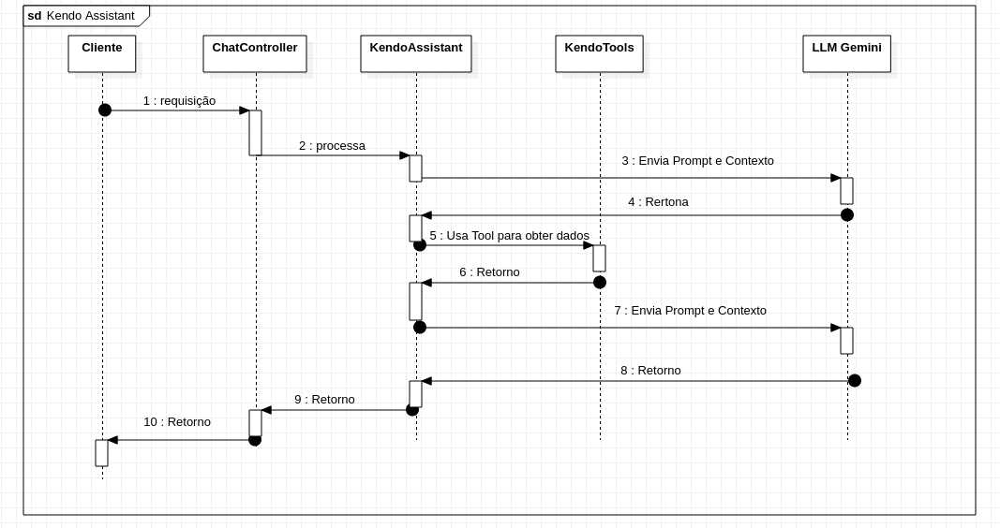

# Engenharia de Agentes de IA com LangChain4j, Spring Boot e Gemini

[ARTIGO](https://talkingaboutjava.blogspot.com/2026/04/engenharia-de-agentes-de-ia-com.html)

### 1. Arquitetura e Orquestração de Agentes
A solução utiliza o padrão de **Orquestração de Agentes**, onde o **LangChain4j** gerencia o ciclo de vida da requisição ("Chain"). Diferente de uma chamada de API simples, o orquestrador permite que o modelo realize múltiplas iterações de "Pensamento -> Ação -> Observação" antes de entregar a resposta final.

O diagrama de sequência abaixo detalha o fluxo de comunicação entre os componentes do sistema:

*Fluxo de execução: Da requisição do cliente à orquestração de ferramentas e resposta do LLM.*

* **LLM (Large Language Model):** O motor de processamento é o **Google Gemini 2.5 Flash**. LLMs são redes neurais baseadas na arquitetura *Transformer*, treinadas para prever a próxima sequência de tokens. No assistente, ele é utilizado não apenas para gerar texto, mas como um motor de tomada de decisão que compreende intenções e mapeia linguagem natural para chamadas lógicas.
* **Middleware (LangChain4j):** Atua como o elo entre o mundo não estruturado da IA e o mundo tipado do Java. Ele abstrai o gerenciamento de prompts e a serialização de dados para o modelo.

---

### 3. O Mecanismo RAG e Bases Vetoriais
Para que a APlicação entenda sobre a etiqueta do Kendo (Reishiki), regras, exercícios básicos, critérios de avaliação em exames é utilizado uma **RAG (Retrieval-Augmented Generation)**. Este processo supera a limitação de conhecimento "congelado" do modelo original através de uma **Base Vetorial**:

1. **Embeddings:** Manuais em PDF são segmentados em fragmentos (*chunks*). Cada fragmento é processado por um modelo de embedding que converte texto em vetores numéricos (listas de números reais em um espaço multidimensional).
2. **Busca Semântica:** Diferente de uma busca por palavras-chave (SQL LIKE), a base vetorial permite encontrar informações pelo significado. Quando o usuário pergunta algo, o sistema calcula a **Similaridade de Cosseno** entre o vetor da pergunta e os vetores armazenados.
3. **Context Injection:** O trecho mais relevante é recuperado e injetado no prompt do sistema. Isso garante que a resposta do LLM seja fundamentada em documentos oficiais, eliminando respostas inventadas.
